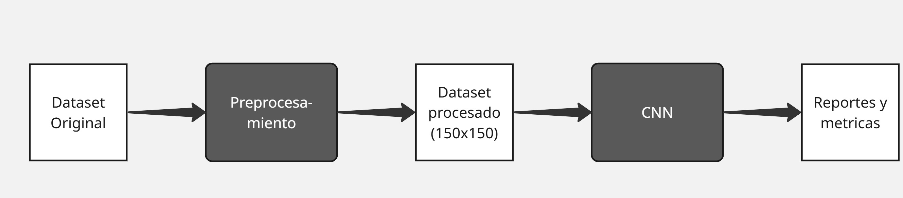
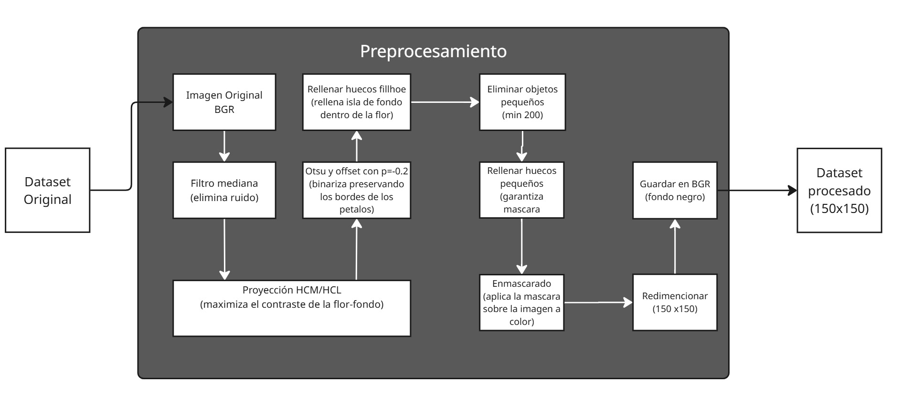
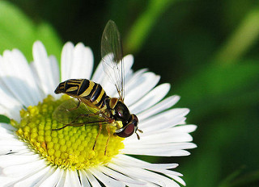

# Impacto del Preprocesamiento de imagenes en el desempeño de una CNN para clasificación de flores

En este proyecto se propono una pipeline de preprocesamiento de un dataset de imagenes de flores, para evaluar como afecta el rendimiento en el entrenamiento de una CNN entrenada ara clasificar 5 tipos de flores del dataset [Flowers Recognition](https://www.kaggle.com/datasets/alxmamaev/flowers-recognition).
Para ello nos basamos en la proyeccion HCL para maximizar el contraste, realizamos una umbralización con Otsu y realizamos un refinamiento morfologico sobre el dataset original para posteriormente entrenar la CNN con este nuevo dataset y compara los resultados con los obtenidos sin el preprocesmaiento.

---

## Propuesta de Preprocesamiento

El objetivo de nuestra propuesta es  **aisalr la flor y eliminar el ruido de fondo (hierba, hojas, etc.)** y de esta forma permitir que la CNN se concentre exclusivamente en el aprendizaje de las caracteristicas de la flor y no en el fondo de las mismas.

El flujo del procesamiento aplicado a cada imagen consiste en lo siguiente:

1. **Filtro de mediana (3x3):** Se realiza un suavizado inicial para eliminar el ruido sin difuminar los bordes de la flor
2. **Proyeccion HCL a escala de grices de máximo contraste (HCM):**
   - proyecta la imagen **BGR** mediante una combinación lineal optimizada $I = w_1 B + w_2 G + w_3 R$
   - Los pesos optimos se encuantran con el algoritmo Nelder-Mead para maximizar la desviación estandar de la imagen en grises divididos por su rango
3. **Umbralización de Otsu con Offset ($p = -0.2$):** 
   - Se binariza la proyección HCM encontrando el umbral óptimo.
   - Se aplica un offset de $-0.2$ para asegurar que se conserven los bordes de los pétalos.
4. **Relleno de Huecos:** Se rellenan los espacios internos vacíos dentro de la máscara
5. **Limpieza Morfológica:**
   - Eliminamos los objetos aislados pequeños en el fondo con un umbral de área de 200 píxeles.
   - Rellenamos los huecos oscuros internos restantes con un umbral de área de 1000 píxeles.
6. **Enmascaramiento Bitwise:** Aplicamos la máscara binaria final sobre la imagen BGR original, resultando en la flor a color sobre un fondo negro absoluto.
7. **Redimensionamiento :** Ajustamos las imágenes procesadas al tamaño necesario para la CNN ($150 \times 150$ píxeles).

En el siguiente diagrama se muestra el flujo general de entrenamieto de la CNN con las imagenes procesadas 

En el Siguiente diagrama se muestra de forma mas clara el flujo del rpocesamiento de las imagens con el pipeline propuesto 

--- 

## Evidencia del procesamiento

A continuación se muestra una comparación entre la imagen original y la procesada:

| Imagen Original  | Flor Segmentada (Fondo Negro) |
| :---: | :---: |
|  |  |

---

## Estructura del repositorio

* `codigo_procesamiento.ipynb`:Codigo en python donde se encuentra el procesamiento completo para aplicar a todo el dataset
* `PROYECTO_FINAL_IMÁGENES_RGB.ipynb`:Codigo que contiene la arquitectura e instrucciones de entrenamiento de la CNN, modificado únicamente con la ruta del dataset procesado.
* `img/`: Carpeta donde se muestran imagenes que utilizadas en este README.md
* `README.md`: Este archivo explicativo de la metodología y resultados.

---

## Instrucciones de Ejecución

### 1. Entorno de ejecución
Ambos codigos, tanto el `codigo_procesamiento.ipynb` como `PROYECTO_FINAL_IMÁGENES_RGB.ipynb` estan pensados para ser utilizados en la plataforma **COLAB** de google. Asi que se recomienda subir el codigo en la carpeta de drive como se muestra a continuacion y abrir el archivo con colab.

* Si el usuario desea no mover nada del codigo debe tener la siguiente estructura de carpetas en su drive:
```python
ORIGINAL_DATASET_DIR = "/content/drive/MyDrive/sistemas_distribuidos_proyecto/flores"
PROCESSED_DATASET_DIR = "/content/drive/MyDrive/sistemas_distribuidos_proyecto/flores_procesadas"
```

* O en su defecto, si no lo quieres hacer asi, solamente asegurate de tener montado la siguiente estructura de carpetas para tus variables:
```python
ORIGINAL_DATASET_DIR = "/ruta/a/flowers"
 PROCESSED_DATASET_DIR = "/ruta/a/flores_procesadas"
```

* Al utilizar un entorno de notebooks de colab al abrir el archivo .ipynb el usuario debe **ejecutar todas las celdas de codigo**. El mismo codigo te avisara cuando se haya terminado de procesar todas las imagenes.

### 2. Entrenamiento de la CNN

Al terminar el procesamiento de las imagenes, en un notebook de colab, ejecutar todas las celdas de codigo de el archivo `proyecto_final_imágenes_rgb.ipynb`, que es donde se encuentra la cnn.
Antes de ejecutar, asegurate que la ruta con las imagenes coincida con la ruta de la carpeta donde se guardaron las imagenes procesadas.

*(Nota: Puedes cambiar el entorno de ejecucion de colab para usar GPU en lugar de CPU, lo cual reducira el tiempo de entrenamiento).*


---

## Resumen de Resultados

| Métrica (Validation) | Modelo Original | Modelo Propuesto | Diferencia |
| :--- | :---: | :---: | :---: |
| **Accuracy** | **77%** | **77%** | **0%** |
| **Precision (Macro Avg)** | **77%** | **77%** | **0%** |
| **Recall (Macro Avg)** | **77%** | **78%** | **1%** |
| **F1-Score (Macro Avg)** | **76%** | **77%** | **1%** |

### Conclusiones Principales:

* **Métricas globales** De forma general las metricas globales mejoraron ligeramente con el procesamiento realizado que con el entrenamiento de el dataset original. Aunque exista esta paridad en las metricas puede ser un poco engoñosa, pues al tener tan poca variacion una de otra, es probables que si se vuelva a realizar los entrenamientos de la CNN es posible que los papeles se inviertan.
* **Mejora en la detección de Rosas (Rose):** Fue la clase más beneficiada por el pipeline. Su *Recall* aumentó un **10%** (pasando de 60% a 70%) y su *F1-Score* subió un **4%**. 
* **Optimización de precisión en Tulipanes (Tulip) y Girasoles (Sunflower):** Los tulipanes aumentaron su precisión en un **7%** (de 71% a 78%) y los girasoles un **2%** (de 74% a 76%).
* **El "Costo" de la pérdida de contexto:** En clases como la Margarita (*Daisy*) y el Diente de León (*Dandelion*), se observó una ligera disminución en precisión y *Recall* respectivamente. 
* **Efectividad de la propuesta:** Aunque las metricas generales del modelo aumentaron ligeramente, no podemos concluir que el procesamiento planteado haya mejorado de forma significativa la deteccion de las diferentes clases de flores de manera global, ya que las metricas globales siguieron muy parejas entre ambos modelos y las metricas individuales en unos casos mejoraron y en otros empeoraron.
